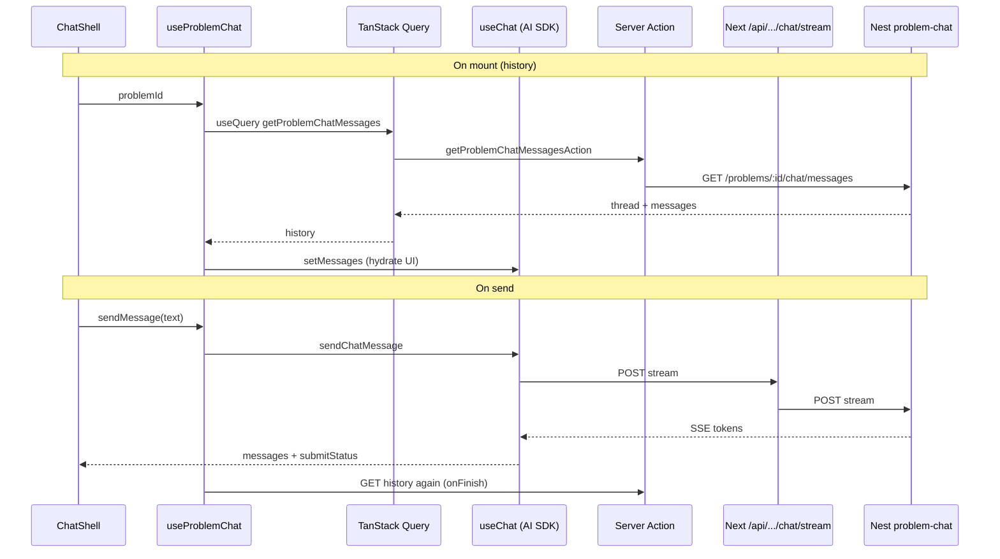

```mermaid
sequenceDiagram
  participant Shell as ChatShell
  participant Hook as useProblemChat
  participant TQ as TanStack Query
  participant UC as useChat (AI SDK)
  participant SA as Server Action
  participant BFF as Next /api/.../chat/stream
  participant API as Nest problem-chat

  Note over Shell,API: On mount (history)
  Shell->>Hook: problemId
  Hook->>TQ: useQuery getProblemChatMessages
  TQ->>SA: getProblemChatMessagesAction
  SA->>API: GET /problems/:id/chat/messages
  API-->>TQ: thread + messages
  TQ-->>Hook: history
  Hook->>UC: setMessages (hydrate UI)

  Note over Shell,API: On send
  Shell->>Hook: sendMessage(text)
  Hook->>UC: sendChatMessage
  UC->>BFF: POST stream
  BFF->>API: POST stream
  API-->>UC: SSE tokens
  UC-->>Shell: messages + submitStatus
  Hook->>SA: GET history again (onFinish)

```