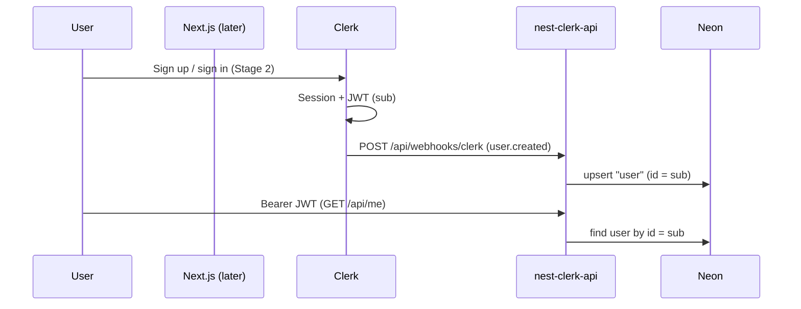

# Clerk + Neon auth (CodeDrill)

Identity and user provisioning for CodeDrill: **Clerk** (sessions + JWT) → **`apps/nest-clerk-api`** (verify JWT, Drizzle/Neon) → existing **`user`** table (Better Auth shape). Practice catalog APIs remain in **`apps/api`** until a later migration; this feature does **not** modify `apps/api` source.

**Spec location:** `apps/app/docs/context/features-spec/clerk-neon-auth/`  
**Implementation target:** `apps/nest-clerk-api/` only  
**Database:** Typically the **same Neon database** as `apps/api` (`DATABASE_URL`)

## Architecture

## Database model (live Neon today)

`nest-clerk-api` and `apps/api` usually share one Postgres database.

| Table | Origin | Role with Clerk |
|-------|--------|-----------------|
| **`user`** | Better Auth (`auth:migrate`) | **Profile row** — webhook upserts here; `id` = Clerk JWT `sub` |
| **`session`** | Better Auth | **Legacy** — not written after Clerk cutover; optional cleanup on `user.deleted` |
| **`account`** | Better Auth | **Legacy** — email/OAuth credentials for Better Auth; not used for Clerk sign-in |
| **`verification`** | Better Auth | **Legacy** — email verification flows |
| **`problems`, `problem_progress`, …** | Drizzle / `apps/api` | Unchanged; `user_id` is `text` (should match `user.id`) |

**Do not** add a parallel **`users`** table or **`clerk_user_id`** column unless you have a migration plan for existing `user` rows and all `problem_* .user_id` values.

Clerk **`sub`** maps directly to **`user.id`** (text primary key).

## Principles

1. **Clerk owns identity** — sign-up, OAuth, sessions, JWTs (not the `session` table).
2. **Webhooks own provisioning** — upsert **`user`**; JWT verification does **not** insert rows.
3. **API owns authorization** — scope by `user.id` (= JWT `sub`) on practice tables via `user_id` text.
4. **Fail closed** — invalid/missing JWT → 401; valid JWT but no `user` row → 404; wrong owner → 404 (not 403).

## Delivery focus

| Phase | Stages | Status |
|-------|--------|--------|
| **Backend now** | 0, 1, 3, 4, 5 (auth slice only) | Active |
| **Frontend later** | 2, 6 | Deferred (`@repo/clerk` is a separate feature) |

## Stages

| # | Stage | Outcome |
|---|--------|---------|
| [0](./00-drizzle.md) | Drizzle + Neon | Shared DB rules, scripts, `DRIZZLE` wiring |
| [1](./01-foundation.md) | Foundation | Drizzle model for **`user`**, env validation |
| [2](./02-clerk-frontend.md) | Clerk frontend | *Deferred* — Next.js Clerk UI + Bearer calls |
| [3](./03-webhook-provisioning.md) | Webhook provisioning | Upsert **`user`** from Clerk events |
| [4](./04-api-authentication.md) | API authentication | Global guard, `GET /me` → **`user`** row |
| [5](./05-api-authorization.md) | API authorization | `*ForUser` scoping on `user_id` |
| [6](./06-provisioning-ux.md) | Provisioning UX | *Deferred* — wait for `GET /me` after sign-in |

## Reference implementation (this repo)

| Concern | Path |
|---------|------|
| Drizzle setup | [00-drizzle.md](./00-drizzle.md) |
| Auth Drizzle schema | `apps/nest-clerk-api/src/database/schema.ts` — **`user` only** for push |
| Drizzle client | `apps/nest-clerk-api/src/database/drizzle.ts` |
| Practice domain (read-only) | `apps/api/src/database/schema.ts` |
| JWT / Clerk client | `apps/nest-clerk-api/src/auth/clerk.service.ts` |
| Global guard | `apps/nest-clerk-api/src/auth/clerk-auth.guard.ts` |
| Webhook (to add) | `apps/nest-clerk-api/src/webhooks/` |
| User service (to add) | `apps/nest-clerk-api/src/users/` — `findById(sub)` |

## Environment (`apps/nest-clerk-api/.env`)

| Variable | Required | Purpose |
|----------|----------|---------|
| `DATABASE_URL` | Yes | Same Neon DB as `apps/api` in dev (typical) |
| `CLERK_SECRET_KEY` | Yes | JWT verify + webhook email enrichment |
| `CLERK_WEBHOOK_SECRET` | Yes | Svix signing secret |
| `CLERK_AUTHORIZED_PARTIES` | No | Comma-separated origins for `verifyToken` |
| `PORT` | No | Default **3031** |

All HTTP routes use the global prefix **`/api`** (e.g. `/api/me`, `/api/health`, `/api/webhooks/clerk`).

## Data migration note

Existing `problem_progress.user_id` (and similar) may reference **old** ids (e.g. pre-Clerk UUIDs) that do not match current `user.id`. New Clerk users get `user.id = sub`. Plan a one-off migration or accept orphaned progress rows in dev.

## Copy-paste prompt

See **[IMPLEMENTATION-PROMPT.md](./IMPLEMENTATION-PROMPT.md)**.
