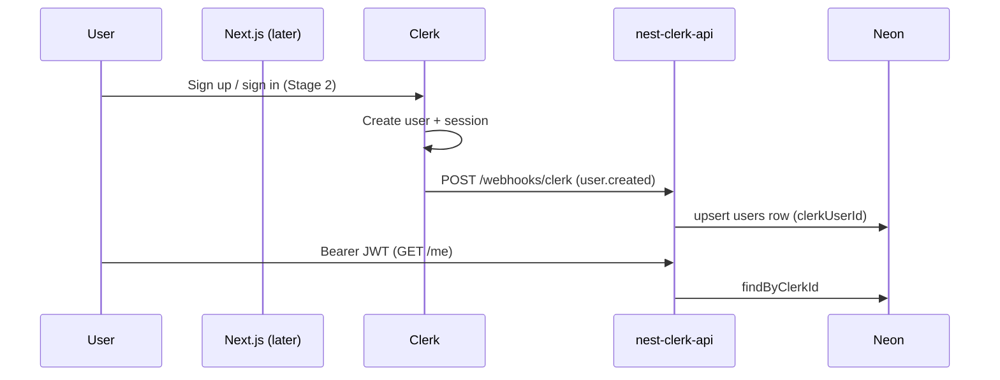

# Clerk + Neon auth (CodeDrill)

Identity and user provisioning for CodeDrill: **Clerk** (sessions + JWT) → **`apps/nest-clerk-api`** (verify JWT, Drizzle/Neon) → **`users` table**. Practice catalog and problem APIs remain in **`apps/api`** until a later migration; this feature does **not** modify `apps/api`.

**Spec location:** `apps/app/docs/context/features-spec/clerk-neon-auth/`  
**Implementation target:** `apps/nest-clerk-api/` only

## Architecture

## Principles

1. **Clerk owns identity** — sign-up, OAuth, sessions, JWTs.
2. **Webhooks own provisioning** — local `users` row; JWT verification does **not** insert users.
3. **API owns authorization** — user-scoped reads/writes filter by resolved `users.id` or `clerkUserId` in Drizzle queries (no Postgres RLS in this design).
4. **Fail closed** — invalid/missing JWT → 401; valid JWT but no DB user → 404; wrong owner → 404 (not 403).

## Delivery focus

| Phase | Stages | Status |
|-------|--------|--------|
| **Backend now** | 0, 1, 3, 4, 5 (auth slice only) | Active |
| **Frontend later** | 2, 6 | Deferred (`@repo/clerk` is a separate feature) |

## Stages

| # | Stage | Outcome |
|---|--------|---------|
| [0](./00-drizzle.md) | Drizzle + Neon | Init Drizzle, `drizzle-kit` scripts, Nest `DRIZZLE` wiring |
| [1](./01-foundation.md) | Foundation | `users` table, env validation, `DatabaseService` |
| [2](./02-clerk-frontend.md) | Clerk frontend | *Deferred* — Next.js Clerk UI + Bearer calls |
| [3](./03-webhook-provisioning.md) | Webhook provisioning | `POST /webhooks/clerk`, upsert `users` |
| [4](./04-api-authentication.md) | API authentication | Global `ClerkAuthGuard`, `GET /me` → DB user |
| [5](./05-api-authorization.md) | API authorization | `*ForUser` Drizzle scoping for user-owned rows |
| [6](./06-provisioning-ux.md) | Provisioning UX | *Deferred* — wait for `GET /me` after sign-in |

## Reference implementation (this repo)

| Concern | Path |
|---------|------|
| Drizzle setup (scripts, init) | [00-drizzle.md](./00-drizzle.md) |
| Drizzle schema | `apps/nest-clerk-api/src/database/schema.ts` |
| Drizzle client | `apps/nest-clerk-api/src/database/drizzle.ts` |
| drizzle-kit config | `apps/nest-clerk-api/drizzle.config.ts` |
| DB module | `apps/nest-clerk-api/src/database/database.module.ts` |
| Env validation | `apps/nest-clerk-api/src/config/env.ts` |
| JWT / Clerk client | `apps/nest-clerk-api/src/auth/clerk.service.ts` |
| Global guard | `apps/nest-clerk-api/src/auth/clerk-auth.guard.ts`, `public.decorator.ts` |
| Webhook (to add) | `apps/nest-clerk-api/src/webhooks/` |
| Users service (to add) | `apps/nest-clerk-api/src/users/` |
| Future domain schema | `apps/api/src/database/schema.ts` (read-only reference for Stage 5) |

## Environment (`apps/nest-clerk-api/.env`)

| Variable | Required | Purpose |
|----------|----------|---------|
| `DATABASE_URL` | Yes | Neon Postgres (HTTP driver) |
| `CLERK_SECRET_KEY` | Yes | JWT verify + webhook email enrichment |
| `CLERK_WEBHOOK_SECRET` | Yes | Svix signing secret from Clerk Dashboard |
| `CLERK_AUTHORIZED_PARTIES` | No | Comma-separated origins for `verifyToken` |
| `PORT` | No | Default **3031** |

## Copy-paste prompt

See **[IMPLEMENTATION-PROMPT.md](./IMPLEMENTATION-PROMPT.md)**.
