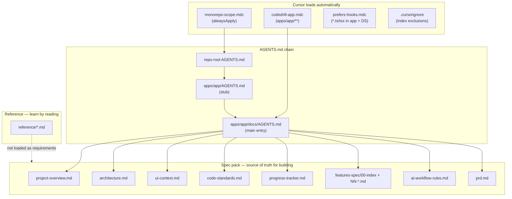
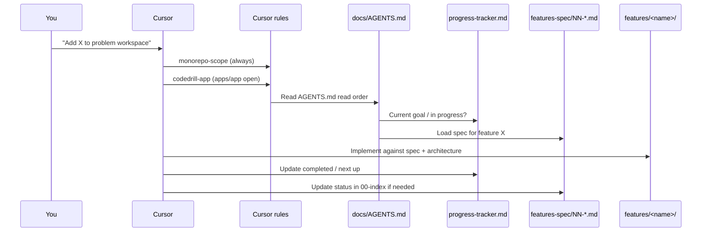

# How AGENTS.md, Cursor rules, and feature specs work together

This note explains the **documentation system** CodeDrill uses so humans and Cursor agents stay aligned. It is explanatory — not a product requirement. If anything here disagrees with a file in [`../context/`](../context/), the context file wins.

## The big picture

CodeDrill splits documentation into three jobs:

| Job | Where it lives | Who reads it |
| --- | --- | --- |
| **Tell agents what to do and where to look** | `AGENTS.md` + `.cursor/rules/` | Cursor (always or when matching files are open) |
| **Define what to build** | `docs/context/` + `docs/context/features-spec/` | Agents at task start; you when planning |
| **Explain how things work** | `docs/reference/` (this folder) | You, when learning or revisiting |

---

## AGENTS.md — three files, one workflow

There are three `AGENTS.md` files on purpose. Each layer does a different job.

### 1. Repo root — [`AGENTS.md`](../../../AGENTS.md)

Short **monorepo gate**: stay inside `apps/app/`, `apps/api/`, and `packages/design-system/`. Points agents to the full app entry point at `apps/app/docs/AGENTS.md`.

Cursor loads this via user rules and mirrors the same scope in `.cursor/rules/monorepo-scope.mdc`.

### 2. App stub — [`apps/app/AGENTS.md`](../../AGENTS.md)

A **pointer file** at the app root. Cursor auto-loads `AGENTS.md` when you work under `apps/app/`, so this stub ensures agents land on the real doc without duplicating content.

It says: read `docs/AGENTS.md` and `docs/context/progress-tracker.md` before implementing.

### 3. Main entry — [`apps/app/docs/AGENTS.md`](../AGENTS.md)

The **full agent playbook** for the practice UI:

- **Read order** — which context files to load before coding (overview → architecture → UI → standards → progress tracker → feature specs).
- **Scope** — app vs API vs design system; default assumption that UI work stays in `apps/app`.
- **Implementation defaults** — spec-driven, Server Components first, feature folder layout, thin routes.
- **Progress tracker rules** — update `progress-tracker.md` after every meaningful change.
- **Commands** — `pnpm dev`, `typecheck`, etc.

When you ask Cursor to implement something in the app, this file is the contract for *how* the agent should behave.

---

## Cursor rules — enforcement layer

`.cursor/rules/*.mdc` files are Cursor-specific. They inject instructions when their conditions match. They **repeat and sharpen** what `AGENTS.md` already says, so agents do not have to re-discover conventions every session.

| Rule file | When it applies | What it enforces |
| --- | --- | --- |
| [`monorepo-scope.mdc`](../../../.cursor/rules/monorepo-scope.mdc) | **Always** (`alwaysApply: true`) | Only search/edit `apps/app`, `apps/api`, `packages/design-system`. Ask before touching other apps/packages. |
| [`codedrill-app.mdc`](../../../.cursor/rules/codedrill-app.mdc) | Files under `apps/app/**` | Read `docs/AGENTS.md` + `progress-tracker.md` at task start; feature folder layout; register new specs; update tracker before done; run `typecheck`. |
| [`prefers-hooks.mdc`](../../../.cursor/rules/prefers-hooks.mdc) | `*.ts` / `*.tsx` in app + design system | When refactoring, extract reusable logic into `use-*` hooks colocated under the feature. |

### How rules relate to AGENTS.md

- **AGENTS.md** = narrative playbook (read order, philosophy, file map).
- **Cursor rules** = scoped reminders that fire automatically so agents do not skip steps.
- **Overlap is intentional** — e.g. monorepo scope appears in root `AGENTS.md`, `monorepo-scope.mdc`, and `apps/app/docs/AGENTS.md` so it is hard to miss.

### `.cursorignore`

Works alongside rules but for **indexing**, not instructions. Other monorepo apps and packages are excluded from Cursor’s codebase index (same three allowed paths as scope rules). Root config (`package.json`, `turbo.json`, etc.) can still be read for commands.

---

## Context folder — shared project brain

Everything under [`docs/context/`](../context/) is the **spec pack**: facts and requirements agents should implement against.

| File | Role |
| --- | --- |
| [`project-overview.md`](../context/project-overview.md) | Product goals, users, core flows |
| [`architecture.md`](../context/architecture.md) | Stack, boundaries, auth, storage, invariants |
| [`ui-context.md`](../context/ui-context.md) | Design system usage, tokens, layout patterns |
| [`code-standards.md`](../context/code-standards.md) | TypeScript, Next.js, styling, API conventions |
| [`progress-tracker.md`](../context/progress-tracker.md) | **Live state** — current goal, in progress, completed, open questions |
| [`ai-workflow-rules.md`](../context/ai-workflow-rules.md) | Scoping, protected files, when to split work, doc sync rules |
| [`prd.md`](../prd.md) | Living product doc; wins over placeholders in context |

**Conflict resolution:** feature spec → context architecture/standards → `prd.md` for product truth. Reference notes (this folder) are never requirements.

---

## Feature specs — one feature, one file

Per-feature requirements live in [`docs/context/features-spec/`](../context/features-spec/).

### Index — [`00-index.md`](../context/features-spec/00-index.md)

The **registry**. Every product feature under `apps/app/features/<name>/` should have a row here before or alongside implementation. The table links:

- Spec file (`NN-<feature-name>.md`)
- App UI path
- API / BFF paths
- Status (shipped, in progress, spec TODO)

### Individual specs — `NN-<feature-name>.md`

Numbered files (zero-padded order) describe **one feature unit**:

- Goal and user story
- Requirements (checkboxes)
- System boundaries (UI / BFF / API / DB)
- Proposed file structure under `features/<name>/`
- Acceptance criteria

Start from [`99-feature-spec-template.md`](../context/features-spec/99-feature-spec-template.md), fill it in, then add a row to `00-index.md`.

### Shared UI spec — [`01-design-system.md`](../context/features-spec/01-design-system.md)

Applies to **all** features: folder layout (`components/`, `hooks/`, `utils/`), SOLID-ish boundaries, design tokens from `@repo/design-system`. Every feature spec references this instead of repeating UI rules.

### Nested specs

Large areas can use subfolders (e.g. `clerk-neon-auth/` with staged docs). The index still lists them as one logical feature with links into the folder.

---

## End-to-end flow: from prompt to shipped feature

Typical agent session:

1. **Scope** — `monorepo-scope.mdc` limits search to allowed paths.
2. **Orient** — `codedrill-app.mdc` triggers read of `docs/AGENTS.md` and `progress-tracker.md`.
3. **Specify** — Agent loads the relevant `features-spec/NN-*.md` (and `01-design-system.md` for UI).
4. **Guardrails** — `ai-workflow-rules.md`: one unit at a time, no invented behavior, protected files.
5. **Implement** — Code under `apps/app/features/<name>/`; routes stay thin in `app/`.
6. **Close out** — Update `progress-tracker.md`; run `pnpm typecheck`; register or refresh the spec index.

---

## Reference vs context — do not mix them up

| | `context/` + `features-spec/` | `reference/` (here) |
| --- | --- | --- |
| **Purpose** | What to build; current project state | How things work; mental models |
| **Audience** | Agents + implementers | You (human learner) |
| **Updates when** | Features ship, architecture changes | You learn something worth keeping |
| **Agent treatment** | Source of truth | Helpful background only |

Examples already in this folder: [TanStack Query](./tanstack-query.md), [React Context](./react-context.md). This file belongs here for the same reason — it explains the doc system, it does not define a feature to ship.

---

## Quick cheat sheet

**Starting a new feature**

1. Copy `99-feature-spec-template.md` → `NN-my-feature.md`
2. Add row to `features-spec/00-index.md`
3. Note it in `progress-tracker.md` under In Progress
4. Create `apps/app/features/my-feature/` per `01-design-system.md`

**During implementation**

- Agents read `docs/AGENTS.md` read order + your feature spec
- Cursor rules auto-remind about scope, tracker updates, hooks

**After shipping**

- Move line to Completed in `progress-tracker.md`
- Set status to Shipped in `00-index.md`
- Update spec checkboxes / acceptance criteria if facts changed

**When confused**

- Product behavior → feature spec, then `prd.md`
- Stack / boundaries → `architecture.md`
- “Why did the agent do X?” → this file + `.cursor/rules/`
- “How does TanStack work here?” → `reference/tanstack-query.md`

---

## Related links

- [Reference index](./00-index.md)
- [Reference README](./README.md) — folder purpose vs `context/`
- [App docs AGENTS.md](../AGENTS.md) — full agent entry point
- [Feature specs index](../context/features-spec/00-index.md)
- [AI workflow rules](../context/ai-workflow-rules.md)
- [Progress tracker](../context/progress-tracker.md)
