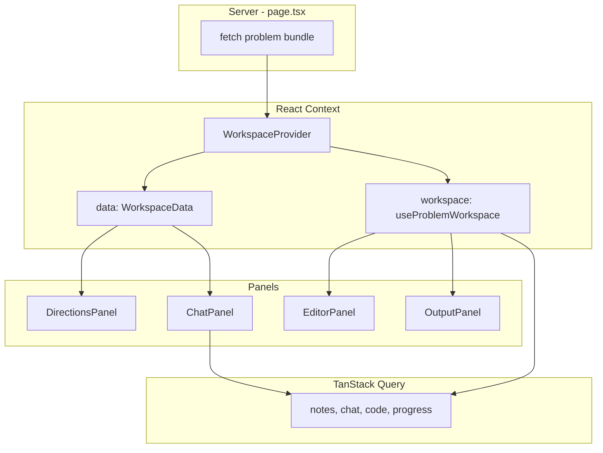

# React Context in CodeDrill

#reference #react #state

Plain-language guide to **who provides what state** via React Context in this app. For API/server cache state, see [[tanstack-query]]. For the workspace refactor rationale, see [16-workspace-state-management](../context/features-spec/16-workspace-state-management.md).

## One-liner

> React Context is how we **share state across a subtree without prop drilling** — theme, auth snapshot, problem workspace data, and the practice timer.

Context holds **client/UI state that many sibling components need**. It does **not** replace the database or TanStack Query.

## Context vs TanStack Query

| | React Context | TanStack Query |
| --- | --- | --- |
| **Best for** | UI state + server-fetched *bundle* passed once from the page | Repeated fetch/cache of user-specific API data |
| **Lifetime** | While the provider is mounted | While the tab is open (global `QueryClient`) |
| **Example** | Editor drafts, active tab, problem statement JSON | Saved notes, chat history, progress |

Many features use **both**: workspace context owns editor drafts; TanStack loads saved code from the API and merges into those drafts.

## Provider tree (app-wide)

From the root layout down:

```txt
ClerkProvider                    ← Clerk SDK (not our code)
  ThemeProvider                    ← dark/light mode (@repo/design-system)
    ClerkAuthProvider              ← our context: server userId until Clerk hydrates
      QueryProvider                ← TanStack QueryClient (not React createContext)
        {pages}
```

On a **problem page** only:

```txt
TimerProvider                    ← stopwatch / countdown
  ProblemWorkspace
    WorkspaceProvider            ← problem bundle + editor/run state
      WorkspaceShell
        DirectionsPanel | EditorPanel | OutputPanel | ChatPanel
```

## Each provider — what it owns

### `ThemeProvider` (`@repo/design-system`)

- **Scope:** entire app
- **State:** color theme (dark default)
- **Consumers:** `ModeToggle`, themed components

### `ClerkAuthProvider` + `useClerkAuthSnapshot`

- **Scope:** entire app
- **State:** `{ userId }` from the **server** (`auth()` in root layout)
- **Why:** avoids a flash of “signed out” before Clerk’s client SDK finishes loading
- **Consumers:** `useApiAuth()` combines this snapshot with live Clerk `useAuth()` / `useUser()`

```ts
// Server passes initialUserId → client context until Clerk hydrates
<ClerkAuthProvider initialUserId={userId ?? null}>
```

### `QueryProvider`

- **Scope:** entire app
- **State:** TanStack `QueryClient` (server-data cache — see [[tanstack-query]])
- **Note:** uses `QueryClientProvider`, not `createContext` in our code, but same “wrap the tree” idea

### `WorkspaceProvider` + `useWorkspace()` — main workspace context

- **Scope:** problem workspace page only
- **File:** `features/problem-workspace/components/shell/workspace-provider.tsx`

```ts
type WorkspaceContextValue = {
  data: WorkspaceData;       // server-fetched problem bundle (mostly read-only)
  workspace: ReturnType<typeof useProblemWorkspace>;  // live editor + run state
};
```

**`data` (`WorkspaceData`)** — passed from the server page once:

| Field | Used for |
| ----- | -------- |
| `problemId` | API calls, query keys |
| `problem`, `examples`, `hints` | Directions panel |
| `starterCode`, `testCases` | Editor + Run |
| `solutions`, `learningNotes`, `tags` | Solutions / metadata tabs |

**`workspace` (`useProblemWorkspace`)** — client state for editor + output:

| State / action | Purpose |
| -------------- | ------- |
| `drafts` | Live Monaco text per starter file |
| `activeStarterKey`, `activeTab` | Which file / output tab is selected |
| `consoleEntries`, `lastRunOutcome` | Run output |
| `handleRun`, `handleReset`, `handleSubmit` | Run / reset / submit actions |
| `isPending`, `isSavingCode` | Loading flags |

Panels call `useWorkspace()` directly instead of receiving long prop chains:

- `EditorPanel`, `OutputPanel` → `workspace.*`
- `DirectionsPanel` → `useDirectionsData()` (derived view model from `data`)
- `ChatShell`, `ProblemNotes` → `data.problemId` only

### `TimerProvider` + `useTimer`

- **Scope:** problem page (`app/problems/[slug]/page.tsx`)
- **State:** stopwatch vs countdown, elapsed seconds, running/paused
- **Purpose:** UX timer in the workspace header (cosmetic / practice habit)

## What is intentionally *not* in workspace context

Per [07-problem-chat-ui](../context/features-spec/ai/problem-chat/07-problem-chat-ui.md) and [16-workspace-state-management](../context/features-spec/16-workspace-state-management.md):

| State | Where it lives | Why |
| ----- | -------------- | --- |
| Chat messages / threads | TanStack Query + `useProblemChat` / `useChatSessions` | Server-backed, refetch/invalidate |
| Chat input draft | Local state / AI SDK | Typing shouldn’t rerender whole workspace |
| Notes draft (before Save) | `useState` in `ProblemNotes` | Local edit buffer |
| Saved notes body | TanStack Query | Server-backed |
| Message votes | Local state in chat shell | Client-only for now |

Keeping chat out of `WorkspaceProvider` avoids rerendering editor/output when messages stream in.

## Data flow (problem page)



1. **Server** loads problem JSON → `WorkspaceData`.
2. **`WorkspaceProvider`** receives `data` and runs `useProblemWorkspace` for interactive state.
3. **Panels** read via `useWorkspace()` or small derived hooks (`useDirectionsData`).
4. **TanStack** handles per-user persisted data that changes independently of layout state.

## How to read the code

| Question | Start here |
| -------- | ---------- |
| What goes into context? | `workspace-provider.tsx` |
| What’s in the server bundle? | `shell/lib/workspace-data.ts` |
| Editor drafts + Run? | `editor-panel/hooks/use-problem-workspace.ts` |
| Directions without prop drilling? | `directions-panel/hooks/use-directions-data.ts` |
| Auth for “sign in to save notes”? | `features/auth/hooks/use-api-auth.ts` |
| Who mounts providers? | `app/layout.tsx`, `app/problems/[slug]/page.tsx`, `problem-workspace.tsx` |

## Adding new shared state — decision guide

1. **Only one panel needs it?** → local `useState` in that panel.
2. **Server data fetched/refetched often?** → TanStack Query hook + keys file.
3. **Several workspace panels need it during a session?** → extend `useProblemWorkspace` or `WorkspaceData` (prefer not bloating context with chat-sized state).
4. **Entire app needs it?** → new root provider in `layout.tsx` (rare; theme/auth/query already cover most cases).

## If someone asks in a meeting

“We use React Context at a few boundaries: theme app-wide, a Clerk hydration snapshot for auth, TanStack’s query client for API cache, and on the problem page a `WorkspaceProvider` that holds the problem content from the server plus live editor and run state. Chat and saved notes stay in TanStack Query so streaming and saves don’t force the whole workspace to rerender.”

## Learn more (external)

- [React: Passing Data Deeply with Context](https://react.dev/learn/passing-data-deeply-with-context)
- [React: useContext](https://react.dev/reference/react/useContext)
