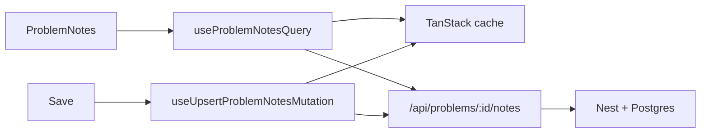

# TanStack Query in CodeDrill

#reference #tanstack

Plain-language guide to what TanStack is doing in this app. For devtools wiring, see [18-tanstack-query-devtools](../context/features-spec/18-tanstack-query-devtools.md). For chat integration detail, see [07-problem-chat-ui](../context/features-spec/ai/problem-chat/07-problem-chat-ui.md).

## One-liner

> TanStack Query is our **in-browser cache for API data** — notes, chat history, saved code, progress — so components don't hand-roll `fetch`, loading states, and cache updates.

It is **not** the database. Postgres + Nest API are the source of truth.

See also: [[react-context]] for how Context and TanStack split state in the workspace.

## What “TanStack” means here

**TanStack** is a family of libraries. CodeDrill uses:

| Library | Used? | Role |
| ------- | ----- | ---- |
| **TanStack Query** (`@tanstack/react-query`) | Yes | Server-state cache |
| TanStack Router | No | — |
| TanStack Form | No | — |
| TanStack Devtools shell | Dev only | Inspect Query cache |

## Server state vs client state

| Kind | Where | Examples |
| ---- | ----- | -------- |
| **Server state** | TanStack Query cache | Saved notes, chat messages, workspace code, progress |
| **Client-only state** | React `useState` / context | Notes draft before Save, chat input draft, panel open/close |

Example: in `problem-notes.tsx`, typing updates local `draft` state. **Save** calls a mutation; on success the cache is updated with the API response so the UI shows “Saved” without another fetch.

## Where it’s wired

```
QueryProvider (app root)
  └── QueryClientProvider
        ├── app pages / features
        └── TanstackDevtools (dev only)
```

- Setup: `components/providers/query-provider.tsx`
- Devtools: `components/devtools/tanstack-devtools.tsx`

Default options: `staleTime: 30_000` (30s fresh), `retry: 1`.

## What’s cached today

| Query key prefix | Hook(s) | What it holds |
| ---------------- | ------- | ------------- |
| `problem-notes` | `useProblemNotesQuery` | Personal note body + `updatedAt` |
| `problem-chat` | `useProblemChat`, `useChatSessions` | Threads + message history |
| `workspace-code` | `useWorkspaceCodeQuery` | Saved editor code |
| `problem-progress` | `useProblemProgressQuery` | Attempt / solve status |

Keys live in `*keys.ts` files next to each query hook (e.g. `problem-notes-keys.ts`).

Queries often use `enabled: …` so they only run when it makes sense (signed in, `problemId` present). Empty devtools before opening a workspace is normal.

## Read path (`useQuery`)

1. Component calls a hook like `useProblemNotesQuery(problemId, isSignedIn)`.
2. TanStack checks the cache for `queryKey`.
3. If missing or stale, runs `queryFn` (usually `fetch` to a BFF route).
4. Hook returns `{ data, isLoading, isError, … }` for the UI.

## Write path (`useMutation`)

1. User action (e.g. Save) calls `mutation.mutate(payload)`.
2. `mutationFn` POSTs/PUTs to the API.
3. `onSuccess` updates cache (`setQueryData`) or invalidates keys so the next read refetches.

Notes save example — cache patch after API success:

```ts
queryClient.setQueryData(problemNotesKeys.problem(problemId), note);
```

## Data flow (notes)



## Code to read

| File | Why |
| ---- | --- |
| `components/providers/query-provider.tsx` | App-wide client |
| `features/.../queries/use-problem-notes-query.ts` | Typical read |
| `features/.../queries/use-upsert-problem-notes-mutation.ts` | Typical write + cache update |
| `features/problem-progress/hooks/use-problem-progress-query.ts` | Another read pattern |

## Learn more (external)

- [TanStack Query overview](https://tanstack.com/query/latest/docs/framework/react/overview)
- [Queries guide](https://tanstack.com/query/latest/docs/framework/react/guides/queries)
- [Mutations guide](https://tanstack.com/query/latest/docs/framework/react/guides/mutations)

## If someone asks in a meeting

“We use TanStack Query to manage server-backed data in the browser — notes, chat, saved code, progress. It fetches from our API, caches results, handles loading and errors, and updates the cache after saves. It’s the layer between React and the API, not our database.”
