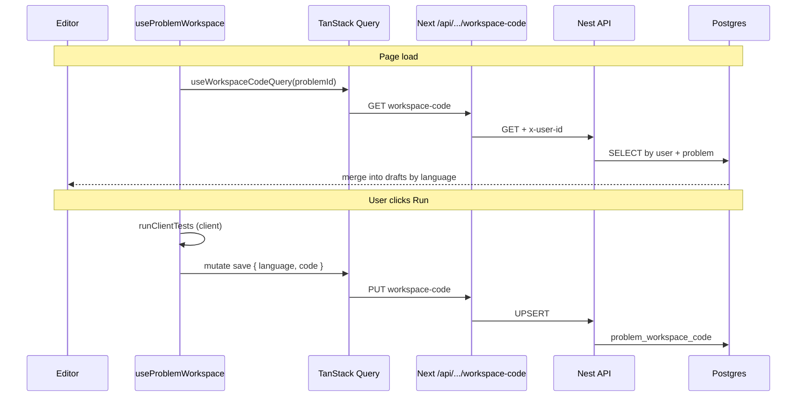

# Workspace code: save on Run, load on page open

Editor text is stored in **`problem_workspace_code`** (one row per user + problem + language), not in **`submissions`**. Submissions remain for graded **Submit** attempts later.

**Related code**

- Queries: `features/problem-detail/components/problem-workspace/queries/`
- BFF: `app/api/problems/[problemId]/workspace-code/route.ts`
- API: `apps/api/src/problem-workspace-code/`
- Schema: `problem_workspace_code` in `apps/api/src/database/schema.ts`

## Sequence

## Auth transport (BFF → API)

The Next route checks **API auth** (`getApiAuth`), then calls the Nest API with:

- `Authorization: Bearer <token>` — from the `codedrill.auth_token` cookie set at sign-in

Requires sign-in; unsigned users get an empty load and no save.

## Error handling

The BFF returns JSON `{ error, code, hint? }`. The workspace shows a red alert and logs save failures to the **Console** tab.

| `code` | Meaning |
|--------|---------|
| `NOT_SIGNED_IN` | No API auth session — use **Sign in** at `/auth/sign-in` |
| `UPSTREAM_UNAUTHORIZED` | Token expired or invalid — sign in again |

## Export diagram as image

Copy the Mermaid block into [Mermaid Live Editor](https://mermaid.live) and export PNG/SVG.
