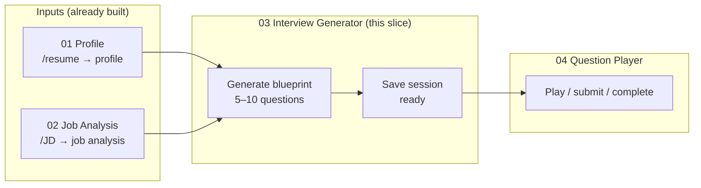
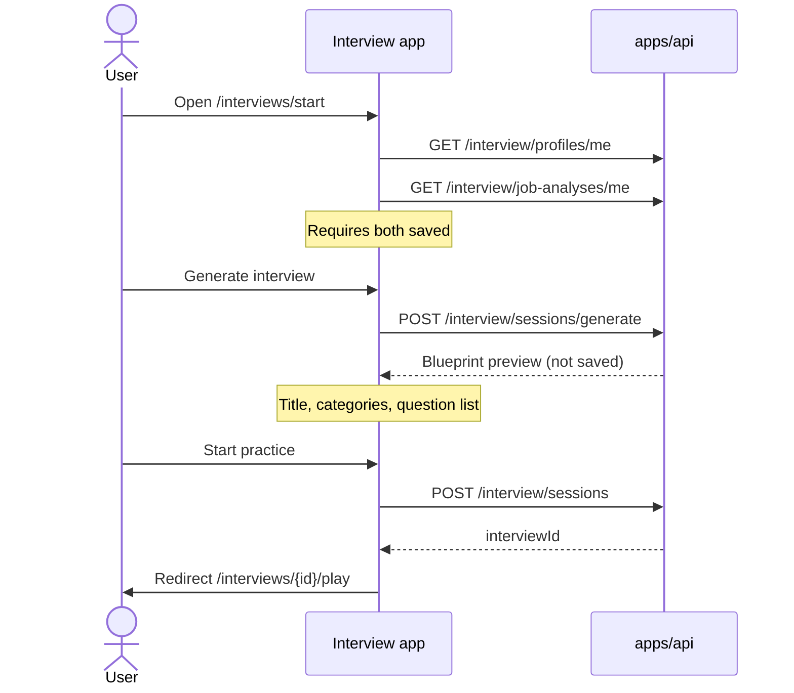
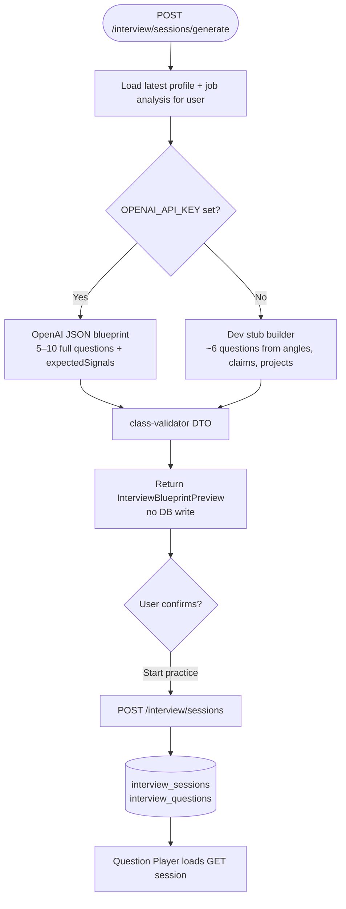
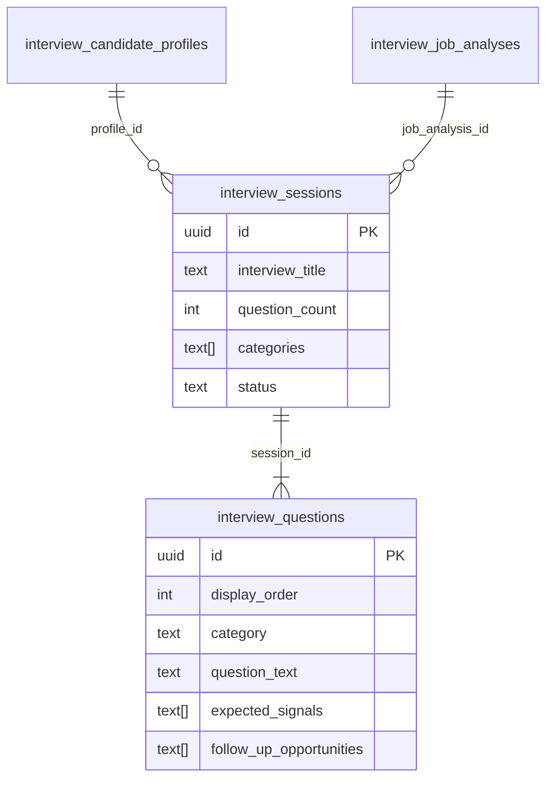

# Interview Generator — implementation plan

**Goal:** Replace dev seed with AI-backed interview generation: profile + job analysis → blueprint preview → persist session → play.

**Feature spec:** [03-interview-generation.md](../feature-specs/03-interview-generation.md)

**Contract authority:** [data-contracts.md](../architecture/data-contracts.md) §3–4 (`InterviewBlueprint`, `InterviewQuestion`)

**Depends on:** Profile + Job Analysis shipped; `interview_sessions` + `interview_questions` (migration `0007`, Question Player Gate 2).

**Blocks:** Answer Evaluation (needs rich `expectedSignals` from generator).

**Out of scope:** Answer scoring, final report, adaptive follow-ups in player, blueprint JSON column (questions live in `interview_questions` rows).

---

## Flow overview (read this first)

### Where this sits in the product

### User journey (`/interviews/start`)

### Question generation (API internals)

### Persist step (what gets written)

### Dev shortcuts (same page, footer)

| Path | Endpoint | Questions | Use |
|------|----------|-----------|-----|
| **Primary** | `generate` → `POST /sessions` | 5–10 | Real product flow |
| **Dev seed** | `POST /sessions/seed` | 3 | Fast local test; skips preview |

### Smoke test

- **Automated:** `pnpm test -- interview-session-generator.smoke.spec.ts` in `apps/api`
- **Manual checklist:** [03-interview-generator-smoke-test.md](../testing/03-interview-generator-smoke-test.md)

### Related docs

| Doc | What it covers |
|-----|----------------|
| [03-interview-generation.md](../feature-specs/03-interview-generation.md) | Product purpose, outputs, MVP scope |
| [04-question-player-implementation.md](./04-question-player-implementation.md) | Play, voice, submit (downstream) |
| [api-contracts.md](../architecture/api-contracts.md) | HTTP bodies and responses |

---

## Architecture decisions (locked)

| Decision | Choice | Rationale |
|----------|--------|-----------|
| Schema | **Reuse `0007` tables** | No new migration for MVP; blueprint = session row + question rows |
| API: preview | **`POST /interview/sessions/generate`** | Transient blueprint; mirrors job-analysis generate |
| API: persist | **`POST /interview/sessions`** | Body = confirmed blueprint + `profileId` + `jobAnalysisId` |
| Inputs | **Latest profile + job analysis** for user; optional UUIDs in generate body later | Matches `/interviews/start` UX |
| Question count | **5–10** (AI); stub targets **6** | Spec MVP |
| Question phrasing | **Full interview questions** in model output | Not job-analysis “angles”; reuse `angleToInterviewQuestion` only in dev stub |
| Dev without OpenAI | **Stub blueprint** from profile + job rows | Same pattern as profile/job-analysis generate |
| Dev seed | **Keep `POST /interview/sessions/seed`** | Fast local fallback; not primary UI |
| UI | **`/interviews/start`** — Generate → preview → Create & start | Replaces seed-only button |

---

## Phases

| Phase | Scope | Status |
|-------|--------|--------|
| P0 | Decisions (this doc) | Done |
| P1 | Schema | Skipped — tables exist |
| P2 | Nest generate + persist + api-contracts | Done |
| P3 | Start page UI + server actions | Done |

---

## Acceptance criteria

- [x] `POST /interview/sessions/generate` returns 5–10 questions with `expectedSignals` (AI or stub)
- [x] `POST /interview/sessions` persists session `ready` + questions; owner-only FK checks
- [x] `/interviews/start` shows preview then navigates to play
- [x] Question Player unchanged (loads session by id)
- [x] Seed endpoint still works for dev
