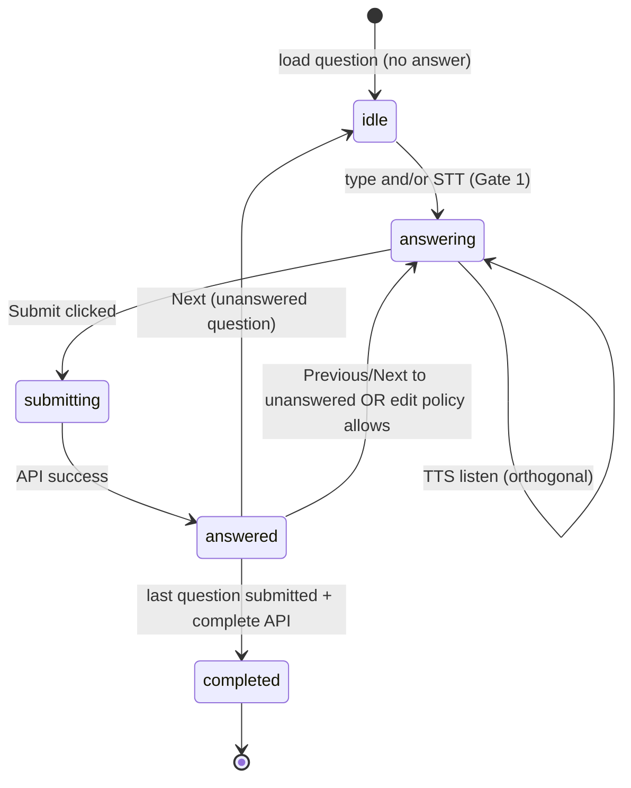

# Question Player — implementation plan

**Goal:** Ship the Question Player in two gates: **(1) Voice flow** — TTS reads question, Record + STT fills textarea; **(2) Full player** — persistence, submit, placeholder feedback, navigation — without question generation, answer evaluation, or final reports.

**User stories (source of truth):** [04-question-player.md](../feature-specs/04-question-player.md) — US-1 through US-8.

**Status:** **Gate 1 in progress** — voice UI at `/interviews/demo/play` (demo session; API in Gate 2).

**Feature spec:** [04-question-player.md](../feature-specs/04-question-player.md)

**Contract authority:** [data-contracts.md](../architecture/data-contracts.md) §4–5 (`InterviewQuestion`, `CandidateAnswer`), §7 (`InterviewSession` runtime shape)

**Depends on:** Clerk auth + `interviewApiFetch` (same as Profile / Job Analysis); **persisted** `interview_sessions` + `interview_questions` rows with question snapshots (see prerequisite below).

**Blocks:** Answer Evaluation slice (needs `transcript` + `expected_signals` on question rows); Final Report slice.

**Out of scope:** Interview Generator AI, evaluation columns, `interview_reports`, OpenAI **answer evaluation**, final report UI, chatbot UX, adaptive follow-ups, **mock/fake STT**, storing audio blobs in Postgres.

**In scope (Gate 1):** Browser **TTS** (read question), **microphone permission**, browser **STT** → textarea (US-4, US-5).

**In scope (Gate 2):** Session API, submit, placeholder feedback, navigation (US-6–US-8).

---

## Alignment with current system

### What exists today

| Layer | Status | Relevance |
|-------|--------|-----------|
| Profile + Job Analysis | **Shipped** (P0–P3) | FK targets for session rows; not used by player UI in this slice |
| `interview_resumes`, `interview_candidate_profiles`, `interview_job_analyses` | Migrated (`0005`, `0006`) | Provenance for sessions |
| `interview_sessions`, `interview_questions` | **Not in schema / no migration** | Required for “questions already in DB” |
| Nest `interview/*` session APIs | **None** | Must add read + answer submit + complete |
| Prototype `/interview` | Static client state machine | Rich reference UI (`ScreenQuestion`, `ScreenFeedback`) — mock data only |
| Route `/interviews/[id]/play` | **Does not exist** | New App Router segment |
| `apps/interview/docs/prd.md`, `architecture/ai-flow.md` | Stubs | Product detail lives in feature specs + data contracts |

### Prototype vs this slice

The prototype at `app/interview/page.tsx` (`InterviewCoach`) already demonstrates:

- Progress bar + “Question N of M”
- Category badge (prototype uses `topic`; contract uses `category`)
- Mock **Start / Stop Recording** with fake transcript typing
- Submit → feedback screen → next question → final report

This slice **reuses UX patterns** from the prototype but:

- Moves to **`/interviews/[interviewId]/play`** with server-loaded session data
- Splits into named components (`InterviewPlayer`, `QuestionCard`, …)
- Persists answers via API (no mock `onSubmit` → local screen flip only)
- Uses **placeholder feedback** (no `ScreenFeedback` scores from mock data, no evaluation API)
- Leaves `/interview` prototype **unchanged** until create/generator wiring (avoids breaking demo)

### Spec vs user-requested boundaries

| Topic | Feature spec (04) | This slice (locked) |
|-------|-------------------|---------------------|
| Submit answer | Sends to **Evaluation System** | Save answer columns only; **no** evaluation call |
| Post-submit UX | Full feedback card (score, strengths, …) | **Placeholder** card + **Next Question** (US-7, Gate 2) |
| Player states | `idle` → `recording` → `transcribing` → … | **`idle` \| `answering` \| `submitting` \| `answered` \| `completed`** (+ placeholder step after submit) |
| `expectedSignals` in UI | Not in spec example layout | **Shown** on `QuestionCard` (US-3) |
| Voice | Mock STT in prototype | **Gate 1:** real TTS + real STT → textarea (US-4, US-5) **before** Gate 2 |
| Complete interview | Route to **Final Report** | Route to **completion placeholder** (`/interviews/[id]/complete` stub) — no report generation |
| Skip / Retry | Listed in spec | **Defer** unless you approve in Phase 0 |

### Architecture doc drift

[overview.md](../architecture/overview.md) still says “static UI prototype / DB not implemented.” Profile and Job Analysis are now persisted; this plan updates that narrative when the slice ships via **progress tracker** only (unless you want overview.md edited in the same PR).

---

## Locked product decisions

| # | Topic | Decision |
|---|-------|----------|
| 0 | **Build order** | **Gate 1 voice flow first**, then Gate 2 persistence/navigation |
| 1 | TTS | User taps button → **read question aloud** (`speechSynthesis` OK for MVP) — US-4 |
| 2 | STT | User taps Record → **mic permission** → **live text in textarea** — US-5; **no mock** |
| 2b | Re-record | **Replace** — new Record clears textarea before STT starts |
| 3 | Post-submit UX | Placeholder + Next — US-7 (Gate 2) |
| 4 | Next without submit | **No** — US-8 |
| 5 | Re-answer | **Yes** — US-6 |
| 6 | Dev data | **Option A** seed |
| 7 | Route | **`/interviews/[interviewId]/play`** |
| 8 | `expectedSignals` | **Show** — US-3 |

---

## Gate 1 — Voice flow (build & validate first)

**Product flow:** [04-question-player.md § Voice-first flow](../feature-specs/04-question-player.md#voice-first-flow-per-question--implement-before-full-player)

```txt
Start interview → Q1 visible
  → [ Listen to question ]  → TTS (optional)
  → [ Record ]              → mic prompt → STT streams into textarea
  → [ Stop ]                → editable transcript in textarea
  → (Gate 2) Submit → feedback → next question
```

### TTS vs STT (do not confuse)

| | TTS (US-4) | STT (US-5) |
|---|------------|------------|
| **Direction** | Text → speech | Speech → text |
| **Trigger** | “Listen to question” | “Record” / “Stop” |
| **API** | `window.speechSynthesis` | Browser Speech Recognition (see below) |
| **Permission** | None | Microphone |
| **Output** | Audio | Characters in `<textarea>` |

### Recommended technical approach (Gate 1)

| Piece | MVP choice | Notes |
|-------|------------|-------|
| **TTS** | Reuse `features/prototype/hooks/use-speech.ts` | Move to `features/interview-player/hooks/use-question-tts.ts`; speaks `question.question` |
| **STT** | **Web Speech API** `SpeechRecognition` / `webkitSpeechRecognition` | `continuous: true`, `interimResults: true`; append `final` + show `interim` in textarea; English `en-US` |
| **Mic permission** | Triggered when STT `start()` runs (and/or explicit `getUserMedia` preflight if needed for UX copy) | On deny: banner + typed fallback |
| **Re-record** | **Stop** then **Record** again **clears textarea** and starts fresh STT (replace, not append) | Locked 2026-06-03 |
| **Browser support** | Chrome, Edge, Safari (webkit); Firefox limited | Feature-detect; degrade to type-only |
| **Server STT** | **Defer** — OpenAI Whisper / Deepgram only if browser STT quality fails QA | No audio upload in Gate 1 |

**Not in Gate 1:** `interviewApiFetch`, submit answer, session DB (can use **mock session** on play page or hardcoded Q1 from `mock-data` until Gate 2).

### Gate 1 — Files (expected)

```
apps/interview/features/interview-player/
  hooks/
    use-question-tts.ts          # from use-speech
    use-answer-stt.ts            # SpeechRecognition wrapper
  components/
    question-card.tsx            # question + Listen button
    answer-input.tsx             # textarea + Record/Stop + permission UI
    voice-answer-controls.tsx    # optional split
```

**Entry for Gate 1 (pick one):**

| Option | Route | Pros |
|--------|-------|------|
| **A (fastest)** | Extend `/interview` prototype **or** `/interviews/[id]/play` with mock/seed question | Validates mic/STT without API |
| **B** | Minimal seed + `GET session` in same PR as voice | More moving parts |

**Recommendation:** **Option A** — single client page with one hardcoded or mock question until STT/TTS QA passes; then Gate 2 wires API.

### Gate 1 — Acceptance checklist

- [x] Question text visible with **Listen to question**; TTS plays and stops.
- [x] **Record** prompts for microphone; denial shows helpful message; typing still works.
- [x] While recording, textarea updates with **real** STT (interim + final), not timed fake strings.
- [x] **Stop** ends recognition; user can edit textarea.
- [x] **Record** again after Stop **clears** textarea and replaces with new take (not append).
- [x] No `sampleTranscript` typing animation; no mock hooks from prototype `screen-question.tsx` recording block.
- [x] TTS stops when Record starts; Listen disabled while recording.
- [ ] Manual test: Chrome + Safari (if available); document Firefox “type only” fallback — **your sign-off**.

**Exit Gate 1:** You sign off voice UX in browser — then proceed to Gate 2.

---


## What is `expectedSignals`?

Field on each `InterviewQuestion` ([data-contracts.md](../architecture/data-contracts.md) §4): string array of **evidence items** a strong answer should cover (e.g. `"token management"`, `"ownership boundaries"`).

| Consumer | Use |
|----------|-----|
| Interview Generator | Writes rubric when creating questions |
| Question Player | **Displays** list to candidate during practice (locked: visible) |
| Answer Evaluation | Compares submitted `transcript` to which signals were demonstrated |

Implementation: include `expectedSignals` in `GET /interview/sessions/:id` question objects; render in `QuestionCard` with short helper copy (not hidden, not editable).

---

## Architecture decisions (engineering)

| Decision | Choice | Rationale |
|----------|--------|-----------|
| `interviewId` in URL | **`interview_sessions.id` (UUID)** | [database.md](../architecture/database.md) |
| Physical tables | **`interview_sessions`**, **`interview_questions`** | One row per question lifecycle |
| API prefix | **`/interview/sessions`** | Parallel to profiles / job-analyses |
| Session load shape | **`InterviewSessionView`** + `questions[]` with `expectedSignals` | US-2, US-3 |
| Answer submit | **`POST` …/questions/:questionId/answer** | Overwrite allowed (US-4) |
| Evaluation columns | **Leave NULL** | Evaluation slice |
| Session status | `ready` → `in_progress` on play; `completed` after all answers | database.md lifecycle |
| Voice | **Gate 1** — TTS + STT → textarea (browser APIs) | Before API/submit |
| Navigation | **Next** gated on submit | US-8 (Gate 2) |
| Current question index | **Client state** | MVP |
| Auth | **Clerk** `/interviews(.*)` in `proxy.ts` | |
| Dev data | **Option A** seed | Until Generator ships |

---

## Prerequisite: data without Interview Generator

**Gap:** Progress tracker lists Interview Generator as “next”; **no code** creates `interview_sessions` / `interview_questions` yet.

**This slice requires one of the following (pick in Phase 0):**

| Option | What you get | Tradeoff |
|--------|--------------|----------|
| **A (recommended)** | Small **dev seed** in `apps/api` (CLI or `POST /interview/sessions/seed` guarded by `NODE_ENV`) | Fast E2E; not production UX |
| **B** | Manual SQL INSERT doc in this plan’s appendix | No code; fragile for teammates |
| **C** | Ship **minimal Generator persistence only** (no OpenAI): `POST /interview/sessions` inserts session + question rows from a fixed fixture | Slightly larger scope; unblocks real “Start interview” later |

**Recommendation:** **Option A** for the player slice PR; Generator PR replaces seed with real `POST` generate later.

Seed minimum per session:

- 1 `interview_sessions` row (`status: ready`, title, `question_count`, FKs to user’s profile + job analysis)
- N `interview_questions` rows (`display_order`, `category`, `difficulty`, `question_text`, `expected_signals`, `follow_up_opportunities`)

---

## Acceptance criteria (implementation checklist)

Map to user success criteria + [04-question-player.md](../feature-specs/04-question-player.md) (MVP subset).

- [x] **P0** Product decisions locked (see table above); user stories in feature spec.
- [ ] **P1** Migration `0007` (or next) + Drizzle `interview_sessions`, `interview_questions` in `schema.ts`.
- [ ] **P1** Dev seed creates a playable session for signed-in user.
- [ ] **P2** `GET /interview/sessions/:interviewId` — owner-only, ordered questions, answer fields when present.
- [ ] **P2** `POST /interview/sessions/:interviewId/start` (or auto-start on GET play) — `in_progress`, `started_at`.
- [ ] **P2** `POST /interview/sessions/:interviewId/questions/:questionId/answer` — validates transcript, sets `submitted_at`, `answer_mode`.
- [ ] **P2** `POST /interview/sessions/:interviewId/complete` — when all questions have transcripts; `completed`, `completed_at`.
- [ ] **P2** [api-contracts.md](../architecture/api-contracts.md) documents session player endpoints.
- [ ] **P3** Route `app/interviews/[interviewId]/play/page.tsx` + `InterviewShell`.
- [ ] **P3** Components: `InterviewPlayer`, `QuestionCard`, `ProgressIndicator`, `AnswerInput`, `InterviewNavigation`.
- [ ] **P3** States: idle → answering → submitting → answered; session-level completed.
- [ ] **P3** Submit saves answer; reload shows saved transcript on that question.
- [ ] **P3** Previous / Next moves among questions; Submit on last question completes session.
- [ ] **P3** `QuestionCard` shows `expectedSignals` (US-3).
- [ ] **V1 (Gate 1)** TTS listen button + STT Record/Stop → textarea (US-4, US-5).
- [ ] **P3** Feedback placeholder after submit (US-7); Next gated on submit (US-8).
- [ ] **Boundaries** No OpenAI, no evaluation, no report, no question generation in this module.
- [ ] **P4** Manual QA: seed → play all questions → refresh mid-session → complete.

---

## Phase 0 — Prerequisites & product decisions

**Owner:** Engineer + PM for two UX choices.

1. Read reference code:
   - `apps/interview/features/prototype/components/screen-question.tsx` (layout + mock recording)
   - `apps/interview/features/profile/actions.ts` + `apps/api/src/interview-profile/*` (API pattern)
2. Confirm signed-in dev user has `profileId` + `jobAnalysisId` (from `/profile`, `/job-analysis`) for seed FKs.
3. Lock **post-submit flow** (see Open questions): placeholder feedback step vs auto-advance.
4. Lock **navigation rules**: can user go Next without submitting? can they edit a previous submitted answer?
5. Choose seed option A / B / C.

**Exit:** Decisions table signed off; seed approach documented in PR description.

---

## Phase 1 — Data layer (`apps/api`)

### 1.1 Drizzle schema — `interview_sessions`

| Column (DB) | Type | Contract / notes |
|-------------|------|------------------|
| `id` | uuid PK | `interviewId` |
| `user_id` | text NOT NULL | Clerk `sub` |
| `profile_id` | uuid FK → `interview_candidate_profiles.id` | `profileId` |
| `job_analysis_id` | uuid FK → `interview_job_analyses.id` | `jobAnalysisId` |
| `interview_title` | text NOT NULL | `interviewTitle` |
| `estimated_duration_minutes` | integer NOT NULL | |
| `question_count` | integer NOT NULL | denormalized |
| `categories` | text[] NOT NULL | |
| `status` | enum | `draft`, `ready`, `in_progress`, `completed`, `abandoned` |
| `generated_at` | timestamptz NOT NULL | |
| `started_at` | timestamptz nullable | |
| `completed_at` | timestamptz nullable | |
| `created_at` / `updated_at` | timestamptz | |

**Indexes:** `(user_id, status, updated_at DESC)` per [database.md](../architecture/database.md).

### 1.2 Drizzle schema — `interview_questions`

**Question snapshot columns** (set at seed/generator time):

| Column | Type | Contract field |
|--------|------|----------------|
| `id` | uuid PK | `InterviewQuestion.id` |
| `session_id` | uuid FK CASCADE | |
| `display_order` | integer NOT NULL | `order` (1-based) |
| `category` | text NOT NULL | |
| `difficulty` | text NOT NULL | |
| `question_text` | text NOT NULL | `question` |
| `expected_signals` | text[] NOT NULL | |
| `follow_up_opportunities` | text[] NOT NULL | default `[]` |

**Answer columns** (NULL until submit):

| Column | Type | Contract field |
|--------|------|----------------|
| `answer_mode` | enum `voice` \| `text` | |
| `transcript` | text | |
| `duration_seconds` | integer nullable | |
| `submitted_at` | timestamptz | |

**Evaluation columns:** add nullable columns per database.md for forward compatibility, but **do not write** in this slice.

**Unique:** `(session_id, display_order)`.

### 1.3 Migration + seed

- `apps/api/drizzle/0007_interview_sessions_questions.sql` (number may shift).
- `pnpm db:migrate` from `apps/api`.
- Dev seed module or script (Option A): creates session `ready` with 3–5 fixture questions for `request.userId` from latest profile/job analysis.

**Exit:** Rows queryable; seed ID documented for QA.

---

## Phase 2 — API (`apps/api`)

### 2.1 Module layout

```
apps/api/src/interview-session/
  interview-session.module.ts
  interview-session.controller.ts
  interview-session.service.ts
  interview-session-seed.service.ts   # dev only, or separate script
  dto/submit-answer.dto.ts
  dto/interview-session-view.ts       # response typing / mapper
```

Register in `app.module.ts`. Mirror `ProblemsUserGuard` on controller.

### 2.2 Endpoints

| Method | Path | Code | Behavior |
|--------|------|------|----------|
| `GET` | `/interview/sessions/:interviewId` | 200 | Session + questions ordered; 404 / 403 if not owner |
| `POST` | `/interview/sessions/:interviewId/start` | 200 | If `ready` → `in_progress`, set `started_at` (no-op if already started) |
| `POST` | `/interview/sessions/:interviewId/questions/:questionId/answer` | 200 | Body: `{ transcript, answerMode, durationSeconds? }`; trim transcript; reject empty |
| `POST` | `/interview/sessions/:interviewId/complete` | 200 | Require all questions have `submitted_at`; set `completed` |
| `POST` | `/interview/sessions/seed` | 201 | **Dev only** — create fixture session; return `{ interviewId }` |

**Validation:**

- `transcript` min length (e.g. 10 chars) — tune with PM.
- `answerMode` enum.
- `questionId` belongs to session.

**Response view (example shape):**

```ts
type InterviewSessionView = {
  id: string
  interviewTitle: string
  estimatedDurationMinutes: number
  questionCount: number
  categories: string[]
  status: InterviewStatus
  startedAt: string | null
  completedAt: string | null
  questions: Array<{
    id: string
    order: number
    category: string
    difficulty: string
    question: string
    expectedSignals: string[]
    answer: {
      answerMode: "voice" | "text"
      transcript: string
      durationSeconds?: number
      submittedAt: string
    } | null
  }>
}
```

Include **`expectedSignals`** on each question in the API view (US-3).

### 2.3 api-contracts.md

Add **Question Player / Interview Session** section (table format like Profile).

**Exit:** curl or integration test: GET session → submit Q1 → GET shows answer → complete after all.

---

## Phase 3 — Interview app (`apps/interview`)

### 3.1 Types

Extend `apps/interview/lib/interview-api/types.ts`:

- `InterviewStatus`, `AnswerMode`, `InterviewQuestionView`, `InterviewSessionView`
- `SubmitAnswerInput`

### 3.2 Server actions

`apps/interview/features/interview-player/actions.ts`:

- `getInterviewSessionAction(interviewId)`
- `startInterviewSessionAction(interviewId)`
- `submitAnswerAction(interviewId, questionId, input)`
- `completeInterviewSessionAction(interviewId)`

Mirror `ProfileActionResult<T>` error handling.

### 3.3 Route

```
app/interviews/[interviewId]/play/page.tsx   # Server Component: load session, pass to client player
app/interviews/[interviewId]/complete/page.tsx  # Stub: "Interview complete — report coming soon"
```

Update `proxy.ts`:

```ts
"/interviews(.*)",
```

Optional dev link on shell nav: “Play (dev)” → last seeded id from env `INTERVIEW_DEV_SESSION_ID`.

### 3.4 Component tree

```
features/interview-player/
  components/
    interview-player.tsx       # State machine + layout; owns currentIndex
    question-card.tsx          # category, difficulty, question text, expectedSignals list
    feedback-placeholder.tsx   # US-5 post-submit card
    progress-indicator.tsx     # title, N of M, bar %
    answer-input.tsx           # textarea + mock record buttons
    interview-navigation.tsx   # Previous, Next, Submit, Complete
  actions.ts
  hooks/
    use-question-player-state.ts  # optional: centralize idle|answering|...
```

**`InterviewPlayer` responsibilities:**

1. On mount: call `startInterviewSessionAction` if status `ready`.
2. Derive `playerState` per current question:
   - No local draft, no saved answer → `idle`
   - Draft in textarea or mock recording → `answering`
   - Save in flight → `submitting`
   - `submitted_at` present → `answered`
3. Session `status === completed` → `completed` (show link to complete page or inline message).
4. **Submit:** `submitAnswerAction` → transition to `answered` → show placeholder or enable Next.
5. **Next/Previous:** change index; load saved transcript into `AnswerInput` when revisiting answered questions.
6. **Last question submit:** call `completeInterviewSessionAction` → redirect `/interviews/[id]/complete`.

**`AnswerInput` (Gate 1 + Gate 2):**

- Shared controlled `<Textarea>` — value from typing **or** STT streaming; **clear on new Record** (replace policy).
- **Listen** delegated to `QuestionCard` or TTS hook (US-4).
- **Record / Stop** via `use-answer-stt` (US-5); `answerMode: "voice"` on submit if user used Record at least once for this question, else `"text"`.
- Optional `useTimer` while recording for `durationSeconds`.
- **Never** use prototype fake transcript interval.

**`InterviewNavigation`:**

| Control | When enabled |
|---------|----------------|
| Previous | `currentIndex > 0` |
| Next | Only when current question is **submitted** and user dismissed placeholder (US-5, US-6) |
| Submit Answer | `answering` and non-empty transcript |
| Complete | Auto after last question submit + `complete` API |

### 3.5 UI / design system

- Use `@repo/design-system` `Button`, `Textarea`, `Progress` (or custom bar like prototype).
- Wrap in `InterviewShell`.
- Match prototype spacing (`max-w-2xl`, sticky progress header) where cheap.

**Exit:** Signed-in user opens `/interviews/{seedId}/play`, completes all questions, sees complete stub; refresh preserves answers.

---

## Phase 4 — Quality & handoff

1. **Manual QA checklist** — empty transcript, network error, mid-session refresh, back button on answered question, concurrent tab (last write wins).
2. **Typecheck** — `pnpm typecheck` in `apps/api` and `apps/interview`.
3. **Handoff to Evaluation slice** — document that `expected_signals` + `transcript` are on `interview_questions`; evaluation will `PATCH` score columns.
4. **Progress tracker** — Mark Question Player slice complete; set Next Up to Answer Evaluation or Interview Generator.

---

## State machine (MVP)



**Session status (server):**

```txt
ready → in_progress (start on play)
in_progress → completed (all questions answered + complete)
```

---

## Explicitly deferred

| Item | Owner slice |
|------|-------------|
| OpenAI answer evaluation | Answer Evaluation (05) |
| Populate `score`, `strengths`, … on question rows | Answer Evaluation |
| `interview_reports` + final report UI | Final Report (06) |
| Server-side Whisper / audio upload | Post–Gate 1 if browser STT insufficient |
| Mock / fake voice transcripts | **Never** |
| `ScreenFeedback` real scores | Evaluation + player wire-up |
| Skip question / Retry answer | Product decision + later PR |
| Interview Generator AI | Generator (03) |
| Wire `/interview` prototype to real session id | Create flow / generator PR |
| List sessions dashboard | Post-MVP |
| Persist “current question index” server-side | Post-MVP |

---

## File touch list (expected)

| App | Files (new or edit) |
|-----|---------------------|
| `apps/api` | `drizzle/0007_*.sql`, `schema.ts`, `interview-session/*`, `app.module.ts`, optional seed |
| `apps/interview` | `app/interviews/[interviewId]/play/page.tsx`, `complete/page.tsx`, `features/interview-player/*`, `lib/interview-api/types.ts`, `proxy.ts`, shell nav (optional) |
| `apps/interview/docs` | `api-contracts.md`, `context/progress-tracker.md` |

**Do not modify** (unless you explicitly expand scope):

- `features/prototype/*` (keep static demo)
- `interview-profile`, `interview-job-analysis` modules except shared schema file
- `packages/design-system` (consume only)

---

## Implementation phases vs user stories

| Gate / PR | User stories | Notes |
|-----------|--------------|-------|
| **Gate 1 — Voice** | US-4, US-5 (+ US-2 UI shell, US-3 signals optional) | TTS + STT → textarea; mock or seed question OK |
| **Gate 2 — Player** | US-1, US-2, US-3, US-6, US-7, US-8 | DB, API, submit, placeholder, navigation |
| **Other systems** | — | Evaluation (05), Report (06), Generator (03) |

---

## Open questions (remaining)

1. **Overview.md** — Update “DB not implemented” when slice ships, or separate doc pass?

---

## Suggestions (senior engineer)

1. **Ship persistence + read API even if UI lags one PR** — Unblocks Generator and Evaluation teams on the same tables.
2. **Keep evaluation columns in migration** — Avoid a second migration when Evaluation lands; just leave NULL.
3. **Use Server Component for initial load** — `play/page.tsx` fetches session; pass `initialSession` to client `InterviewPlayer` to avoid loading flash; mutations via server actions.
4. **Idempotent answer POST** — Simplifies “edit and resubmit” and refresh retries.
5. **Do not fork prototype into production wholesale** — Extract `useTimer` only; drop typewriter and TTS unless product insists.
6. **Complete redirect** — `/interviews/[id]/complete` avoids implying report exists; link back to home or future report route.
7. **Consider `?q=2` in URL** — Shareable deep link to question; optional MVP+.
8. **Align progress tracker open questions** — This slice implicitly chooses **feedback after each question (placeholder only)** and **shows transcript**; document that in tracker when merging.

---

## Suggested PR sequence

1. **PR1 (Gate 1):** Voice hooks + `AnswerInput` / `QuestionCard` on play route (mock or single question) — **TTS + STT only**.
2. **PR2:** Phase 1 migration + dev seed + Phase 2 session API.
3. **PR3 (Gate 2):** Wire play route to API; submit; placeholder feedback; navigation; `expectedSignals`.
4. **PR4 (optional):** Server STT fallback, `?q=` deep link, shell dev link.

---

## References

| Doc | Use |
|-----|-----|
| [04-question-player.md](../feature-specs/04-question-player.md) | UX flow, components, states |
| [data-contracts.md](../architecture/data-contracts.md) §4–7 | `InterviewQuestion`, `CandidateAnswer`, `InterviewSession` |
| [database.md](../architecture/database.md) §4–5 | Table columns, lifecycle |
| [api-contracts.md](../architecture/api-contracts.md) | BFF HTTP tables |
| [03-job-analysis-implementation.md](./03-job-analysis-implementation.md) | Plan structure template |
| `screen-question.tsx`, `interview-coach.tsx` | Prototype UX reference |
